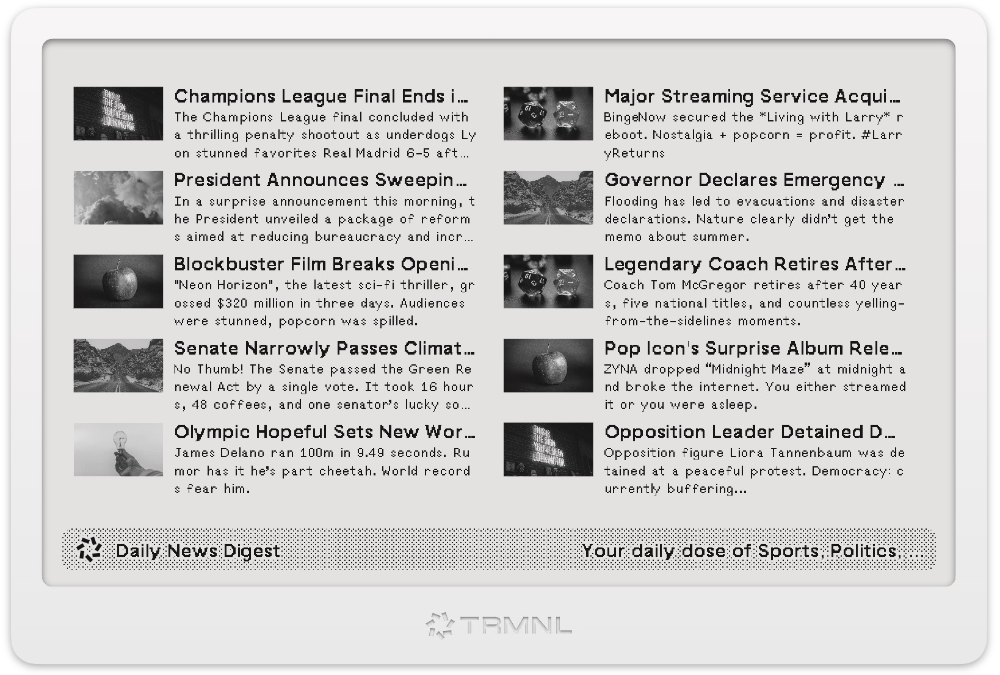

# Advanced RSS Plugin for TRMNL
Advanced RSS Plugin with Thumbnail Support and various settings for adjusting the content display. _Version v0.1.0_.

- https://usetrmnl.com/recipes/79118/
- [Changelog](https://github.com/heroheman/trmnl_advanced_rss/blob/main/CHANGELOG.md)

## Example Layouts with applied options

_Screenshots taken in *v0.2.2* - there might be changes_

## Links

- https://usetrmnl.com/recipes
- https://usetrmnl.com/plugins
- https://usetrmnl.com/integrations

### Docs
- https://docs.usetrmnl.com/go/private-plugins/templates
- https://docs.usetrmnl.com/go/private-plugins/templates-advanced
- https://docs.usetrmnl.com/go/private-plugins/create-a-screen
- https://docs.usetrmnl.com/go/reusing-markup

#### Design Framework
- https://usetrmnl.com/framework
#### Template Language: 
- https://shopify.github.io/liquid/
- https://help.usetrmnl.com/en/articles/10347358-custom-plugin-filters
#### Javascript
- https://help.usetrmnl.com/en/articles/10693981-advanced-liquid