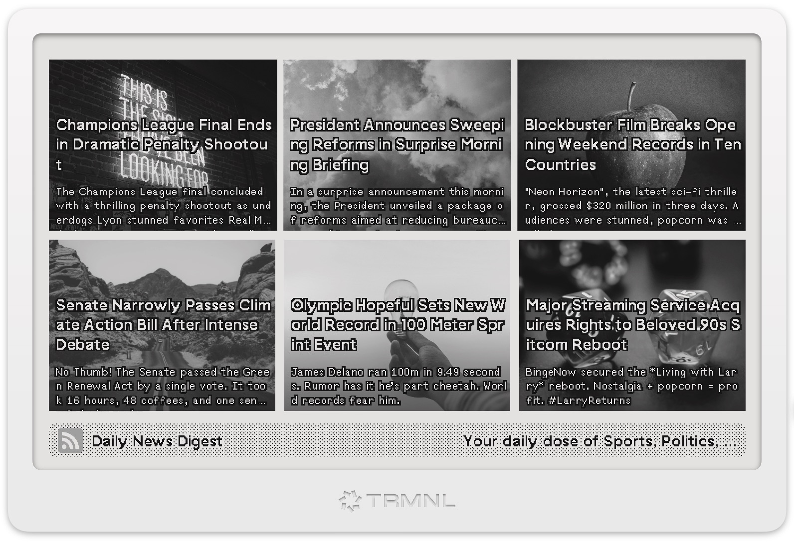

# Advanced RSS Plugin for TRMNL Display

A sophisticated RSS feed display plugin for [TRMNL](https://usetrmnl.com) e-ink devices that transforms your favorite RSS feeds into beautifully formatted, customizable layouts. This plugin goes beyond basic RSS display by offering multiple layout options, thumbnail support, and granular control over content presentation.

## ✨ Key Features

- **6 Distinct Layout Modes**: From compact lists to elegant grids, choose the perfect layout for your content
- **Smart Image Handling**: Optional thumbnail display with intelligent fallbacks
- **Flexible Content Display**: Toggle descriptions, customize text clipping, and control information density  
- **Screen-Optimized**: Layouts specifically designed for 800x480 e-ink displays
- **Responsive Design**: Adapts to different content types and feed structures
- **Easy Configuration**: Simple settings to match your personal preferences

**Version:** v0.3.0 | [**Recipe:**](https://usetrmnl.com/recipes/79118/) | **Changelog:** [View Updates](https://github.com/heroheman/trmnl_advanced_rss/blob/main/CHANGELOG.md)

### How to install

1. [Fork Recipe](https://usetrmnl.com/recipes/79118/install) to your TRMNL 
2. Add your RSS Feed, adjust the settings, set the refresh rate to whatever suits you best.
3. Add it to your Playlist and Mashups

### How to update:
*Important*: As this plugin has custom fields, it can only be forked. This means that it does not automatically update itself when a new version is available, but must be forked again.

## 🏞️ Example Layouts and applied options

| Layout ||
|--------|--------|
|  **Grid:** Show Images, Show Description |  **Grid 2:** Show Images, No Description |
|  **Grid 3:** Show Images, No Description |  **Grid 4:** Show Images, No Description |
|  **Grid:** No Images, Show Description |  **Grid:** No Images, No Description |
|  **List:** Show Images |  **List:** No Images |
|  **List:** Show Images |  **PixelPerfect:** True |  **PixelPerfect:** false |

_Screenshots taken inside trmnlp and in *v0.3.0* - there might be changes_

## Links

- https://usetrmnl.com/recipes
- https://usetrmnl.com/plugins
- https://usetrmnl.com/integrations

### Docs
- https://docs.usetrmnl.com/go/private-plugins/templates
- https://docs.usetrmnl.com/go/private-plugins/templates-advanced
- https://docs.usetrmnl.com/go/private-plugins/create-a-screen
- https://docs.usetrmnl.com/go/reusing-markup

#### Design Framework
- https://usetrmnl.com/framework

#### Template Language: 
- https://shopify.github.io/liquid/
- https://help.usetrmnl.com/en/articles/10347358-custom-plugin-filters

#### Javascript
- https://help.usetrmnl.com/en/articles/10693981-advanced-liquid